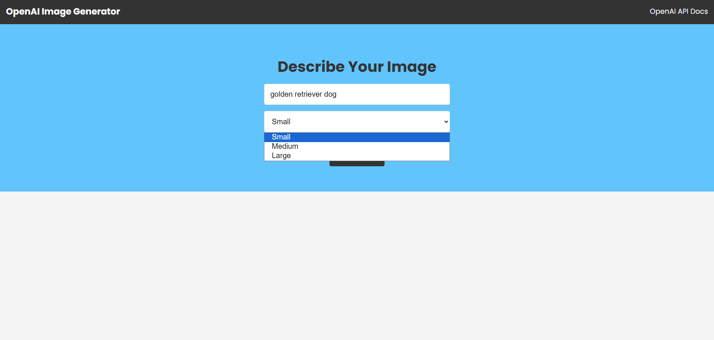
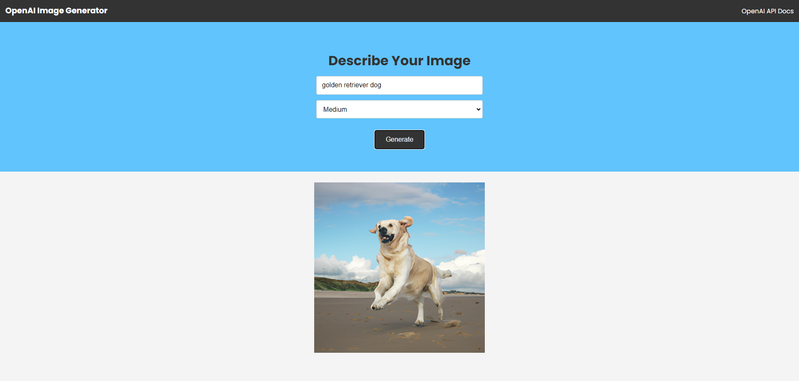

<div align="center">

# AI Image Generator
An AI image generator powered by OpenAI.
</div>

### Setting Up

> ⚠ You need to have Node.js installed!

> ⚠ You also need to Generate an API KEY at [OpenAI](https://beta.openai.com/) and add it to the `.env` and `openaiController` file.

--> Install the dependencies :
```bash
npm install

```

#

### Running The Server

--> To run the server, we use :
```bash
npm start

```

> ⚠ Then, the development server will be started at http://localhost:5000

#

### App Preview :

<table width="100%"> 
<tr>
<td width="50%">      
&nbsp; 
<br>
<p align="center">
  Prompt Preview
</p>

</td> 
<td width="50%">
<br>
<p align="center">
  Result Preview
</p>
  
</td>
</table>
